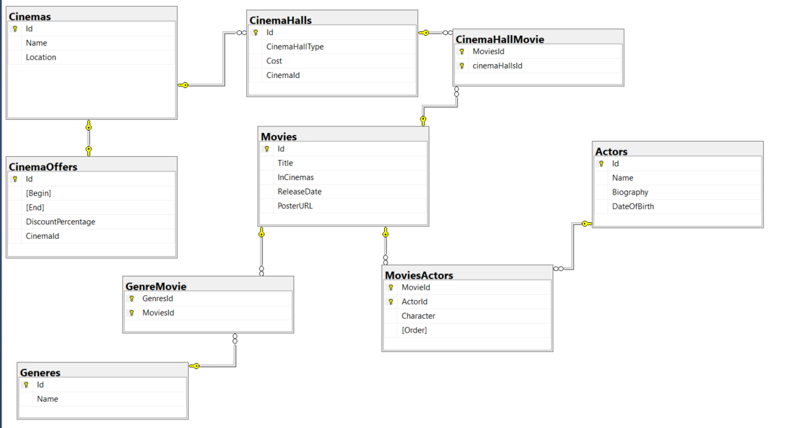
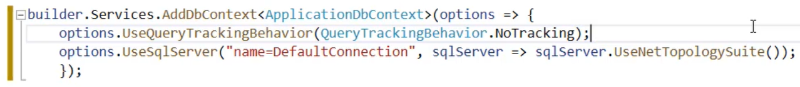

```
dotnet run

dotnet watch

dotnet watch --no-hot-reload

Agenda
- Statuses
- Insert
- Flexible mapping
- Updating
- Deleting
- Query filters

Models of Work
- Ef Core keeps tracking
- SaveChanges saves the pending changes
- Connected model(The idea of this model is that we use the same instance of the dbcontext, both to fetch the data and also to modify the data.)
- Disconnected model
- Entity status

Statuses
- Added
- Modified
- Unchanged
- Deleted
- Detached

Flexible Mapping
When we create an entity, sometimes we only use properties which will represent columns in a table, in sqlserver Typically this is fine.
But there may be other locations in which we may want to use a combination of properties and fields.
The idea is that we may want to use a field to represent our column in the sqlserver table. We will use the property to do a transformation 
over the data that we are about to insert or modify. We call this flexible mapping.

Agenda
- Configuration
- Primary keys
- Ignore
- Idexes, conversions
- Shadow properties
- Automating configurations

Configuration Modes
- When we talk about configurations, we mean defining the behaviour of EF Core when certain things happen.

Indexes
- We can configure indexes in our tables to increase the speed of certain queries.
- Indexes can be configured as unique.
- Primary keys are already configured as unique indexes.

Keyless Entities
- They allow us to express the result of an arbitrary query in terms of a class.
    so, we can enjoy the advantages of a strongly-typed language when consuming arbitrary queries.
- They allow us to centralize queries.
- We don't have to worry about the change tracker.

Summary Configurations, Primary Keys, Ignore, Indexes, Value Conversions, Keyless entities, Shadow Properties, Automating Configurations.

Agenda
- Basic concepts
- Configurations
- OnDelet
- Relationship types

```


